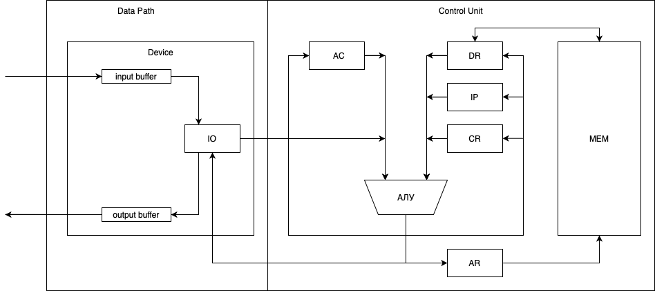

# Архитектура Компьютера. Лабораторная работа №3.

Буторин В.А.

## Вариант

`alg | acc | neum | hw | instr | struct | stream | port | prob2`

* `alg`: javascript-подобный язык.
* `acc`: все вычисления построены вокруг регистра **AC**, выполняющего роль аккумулятора.
* `neum`: команды и данные хранятся в общей памяти. 
* `hw`: Control Unit реализован как часть модели, микрокода нет.
* `instr`: каждая инструкция расписана по-тактово, но в журнале фиксируется только результат выполнения
* `struct` заменено на `binary`: в связи с тем, что данные и инструкции должны храниться в общей памяти, каждая инструкция представляет собой 16-и битное число
* `stream`: ввод-вывод реализован как поток данных
* `port`: передача данных в процессор реализовано через команды (**IN**, **OUT**).
* `prob2`: Even Fibonacci numbers

## Язык программирования

Использована упрощенная версия javascript.
* Объявление переменной через ключевое слово var
* Доступны переменные типа **number** и **string**
* Все переменные должны быть декларированы единожды, декларация в цикле ведет к тому, что значение переменной не изменится
* Доступен цикл **while(num)**: цикл выполняется до тех пор, пока значение переменной num > 0
* Функция **print(num | string)** передает значение переменной в выходной буфер
* Функция **read()** считывает значение из входного буфера
* Операции ветвлений не предусмотрены
* Разрешенные математические операции: **+** (бинарный плюс), *-** (бинарный минус), **=** (присваивание), **+=** (a += b ~ a = a + b), **-=** (a -= b ~ a = a - b)
* Аргументами операций могут выступать значения **number** и переменные этого типа

### BNF

`<program> ::= <term>`

`<term> ::= <variable initialization> | <while loop> | <print function> | <term> <term>`

`<variable initialization> ::= var <name> = <value>`

`<name> ::= [a-zA-Z]+`

`<value> ::= <number> | <string>`

`<value> ::= javascript number`

`<string> ::= javascript string`

`<while loop> ::= while (<number>) { <term> }` 

`<operation> ::= + | - | += | -=`

`<print> ::= print(<value>)`


### Пример

```javascript
//вычисление n-ого числа Фибоначчи
var x = 1
var y = 1
var n = 5
var t = 1
while (n) {
    t = x
    x = y
    y += t
    n--
}
```

```javascript
//вывод строки "hello world!"
var hw = "hello world!"
print(hw)
```


## Система команд

### Модель процессора



* `AC`: аккумулятор (32 битa)
* `DR`: регистр данных (соединен с памятью, MEM(AR) -> DR) (32 битa)
* `IP`: счетчик команд (11 бит)
* `CR`: регистр команд (исполняемая команда) (32 битa)
* `AR`: регистр адреса (соединен с памятью, MEM(AR) -> DR) (11 бит)

#### ВУ

* `input buffer`: буфер входных данных
* `output buffer`: буфер выходных данных
* `IO`: регистр данных ВУ (из него данные попадают из/в АЛУ) (32 бита)

#### MEM

* `слово`: 32 бита
* `объем`: 2048 слов

### Набор инструкций

| Syntax | Mnemonic | Кол-во тактов | Циклы                                                        | Comment                                                     |
|:-------|:---------|:--------------|:-------------------------------------------------------------|:------------------------------------------------------------|
| `1xxx` | ADD M    | 1             | Command<br/> Operand <br/> Execution                         | AC + DR -> AC                                               |
| `2xxx` | SUB M    | 1             | Command<br/> Operand <br/> Execution                         | AC + DR -> AC                                               |
| `3xxx` | LOOP M   | 1             | Command<br/> Operand <br/> Execution                         | if (DR > 0) IP + 1 -> IP                                    |
| `4xxx` | LD M     | 1             | Command<br/> Operand <br/> Execution                         | DR -> CR                                                    |
| `5xxx` | ST M     | 3             | Command<br/> Execution                                       | DR(0-11) -> DR <br/> DR -> AR; AC -> DR <br/> DR -> MEM(AR) |
| `6xxx` | JUMP M   | 1             | Command<br/> Execution                                       | DR(0-11) -> DR; DR(0-11) -> IP                              |
| `7xxx` | JZ M     | 1             | Command<br/> Execution                                       | if (zero_flag == 1) DR(0-11) -> DR; DR(0-11) -> IP          |
| `F000` | NULL     | 1             | Command<br/> Execution                                       | -                                                           |
| `F100` | HLT      | 0             | Command<br/> Execution                                       | STOP                                                        |
| `F200` | CLA      | 1             | Command<br/> Execution                                       | 0 -> AC                                                     |
| `F300` | INC      | 1             | Command<br/> Execution                                       | AC + 1 -> AC                                                |
| `F400` | DEC      | 1             | Command<br/> Execution                                       | AC - 1 -> AC                                                | 
| `F500` | IN       | 1             | Command<br/> Execution                                       | IO -> AC                                                    |
| `F600` | OUT      | 1             | Command<br/> Execution                                       | AC -> IO                                                    |

### Циклы

| Цикл            | Кол-во тактов | Comment                                                   | 
|:----------------|:--------------|:----------------------------------------------------------|
| Command Fetch   | 3             | IP -> AR <br/> MEM(AR) -> DR; IP + 1 -> IP <br/> DR -> CR | 
| Operand Fetch   | 1-4           | Зависит от режима адресации                               | 
| Execution Fetch | -             | См. описание команды                                      |

### Режимы адресации

| Режим    | Mnemonic | Comment           |
|:---------|:---------|:------------------|
| ABSOLUTE | ADD $X   | MEM(X) -> DR      |
| DIRECT   | ADD #X   | X -> DR           |
| RELATIVE | ADD (X)  | MEM(MEM(X)) -> DR | 


## Транслятор

Реализован в классе [**Translator**](./src/main/scala/translator/Translator.scala)

Этапы трансляции
* Загрузка исходного кода
* Построение AST (библиотека [Rhino](https://github.com/mozilla/rhino))
* Первый проход: считывание всех используемых переменных, вычисление их значений
* Запись переменных в файл ассемблера, фиксация адреса начала программы
* Второй проход: перевод каждой инструкции в ассемблер

### Пример

```javascript
//вычисление n-ого числа Фибоначчи
var x = 1
var y = 1
var n = 5
var t = 1
while (n) {
    t = x
    x = y
    y += t
    n--
}
```

```assembly
t: 1
x: 1
y: 1
n: 5
start: NULL
loop1: LOOP $n
JUMP $end1
LD $x
ST $t
LD $y
ST $x
LD $y
ADD $t
ST $y
LD $n
DEC
ST $n
JUMP $loop1
end1: NULL
HLT
```

```javascript
//вывод строки "hello world!"
var hw = "hello world!"
print(hw)
```

```assembly
hwptr: hw
hw: 68
65
6C
6C
6F
20
77
6F
72
6C
64
21
0
start: NULL
loop1: LD (hwptr)
JZ $end1
OUT
LD $hwptr
INC
ST $hwptr
JUMP $loop1
end1: NULL
HLT
```

## Апробация

[ТЕСТЫ](./src/test/scala/integration/IntegrationTest.scala)

* hello world
    - [javascript](./lang/helloWorld.js)
    - [assembler](./lang/helloWorld.as)
    - [input](./lang/helloWorld.in)
    - [output](./lang/helloWorld.out)
    - [log](./lang/helloWorld.log)
* cat 
    - [javascript](./lang/cat.js)
    - [assembler](./lang/cat.as)
    - [input](./lang/cat.in)
    - [output](./lang/cat.out)
    - [log](./lang/cat.log)
* prob2
    - [javascript](./lang/euler2.js)
    - [assembler](./lang/euler2.as)
    - [input](./lang/euler2.in)
    - [output](./lang/euler2.out)
    - [log](./lang/euler2.log)


| ФИО         | алг.  | LoC | code байт | code инстр. | инстр. | такт. | вариант                                                          |
|-------------|-------|-----|-----------|-------------|--------|-------|------------------------------------------------------------------|
| Буторин В.А | hello | 2   | 46        | -           | 10     | 441   | `alg - acc - neum - hw - instr - struct - stream - port - prob2` |       
| Буторин В.А | cat   | 6   | 26        | -           | 12     | 190   | `alg - acc - neum - hw - instr - struct - stream - port - prob2` |
| Буторин В.А | prob2 | 20  | 78        | -           | 32     | 3763  | `alg - acc - neum - hw - instr - struct - stream - port - prob2` |
